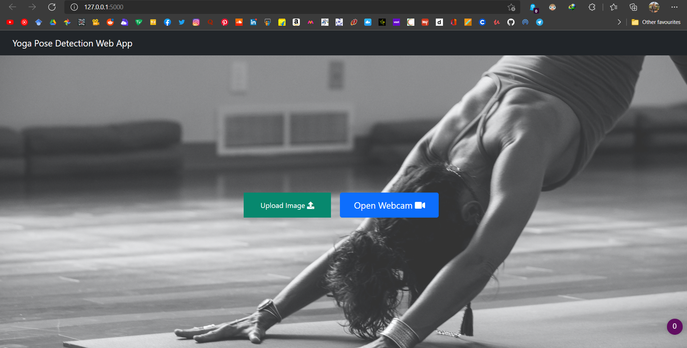

# Yoga Pose Detection

A Flask web application that classifies five yoga poses from an uploaded image or a local webcam stream. It extracts MediaPipe pose landmarks and passes them to the bundled scikit-learn classifier.

> This is an educational computer-vision project, not medical, fitness, or safety advice. A predicted label does not assess form, injury risk, or suitability for a pose.

## Supported Poses

- Downward Dog
- Goddess
- Plank
- Tree
- Warrior II

## How It Works

1. MediaPipe detects 33 body landmarks in an image frame.
2. The application flattens landmark coordinates into model features.
3. `detect_pose.pkl` predicts one of the five classes and returns its highest class probability.
4. Predictions below 50% confidence are displayed as `Unknown Pose`.

The web app supports two local input paths:

- Upload a PNG or JPEG image.
- Open `/webcam` to stream from the camera available to the Python process.

## Preview



## Demo

https://github.com/user-attachments/assets/872f64ea-059f-4513-9586-5e27a499cf09

The 37-second demo video includes playback controls. The versioned source copy remains at `Docs/media/demo.mp4`.

## Quick Start

The model artifact was trained with scikit-learn 0.24.2. Start with Python 3.8 for the best chance of installing that legacy dependency. The exact original environment was not recorded, so treat the setup below as a compatibility baseline rather than a certified reproduction.

```bash
git clone https://github.com/Pulkit3108/Yoga-Pose-Detection.git
cd Yoga-Pose-Detection

python3.8 -m venv .venv
source .venv/bin/activate  # Windows PowerShell: .venv\Scripts\Activate.ps1
python -m pip install --upgrade pip
python -m pip install -r requirements.txt
python app.py
```

Open `http://127.0.0.1:5000` in a browser. The development server is intended only for local use. Do not expose it directly to an untrusted network.

### Troubleshooting

- **The model fails to load:** confirm that `scikit-learn==0.24.2` is installed. Pickled scikit-learn estimators are not reliably portable across versions.
- **No landmarks detected:** use an image with one clearly visible person and adequate lighting. The app returns no prediction when MediaPipe cannot find a pose.
- **Webcam does not open:** the process must have permission to access the local camera. In remote, container, or hosted environments, the webcam route normally cannot access your browser's camera.
- **Installation fails on a newer Python version:** create a Python 3.8 environment, or update and validate the project dependencies and model artifact together.

## Evaluation Notes

The Machine Learning notebook records a 70/30 train-test split with `random_state=42`. Its stored output reports a test accuracy of **98.88%** for both Logistic Regression and Gradient Boosting; the bundled `detect_pose.pkl` is written from the Gradient Boosting pipeline.

That result is a historical notebook output, not an independent benchmark or a guarantee of current runtime performance. It does not establish performance across lighting, camera quality, body types, occlusion, unseen poses, or real-world yoga practice.

## Repository Layout

```text
.
├── app.py                         # Flask application and inference routes
├── detect_pose.pkl                # Bundled Gradient Boosting classifier
├── requirements.txt               # Application dependency compatibility baseline
├── templates/ and static/         # Web interface assets
├── Machine Learning Code/         # Landmark classifier training/evaluation notebook
├── Deep Learning Code/            # Separate TensorFlow experiment and saved model
├── Web Scraper/                   # Dataset/source collection notebook and text artifacts
├── Docs/                          # Original report, presentation, artifact notes, and demo media
├── upload/                        # Local runtime upload area; do not commit new uploads
```

See [artifact notes](Docs/artifacts.md) before modifying or removing notebooks, models, reports, or source data.

## Dependencies And Reproducibility

`requirements.txt` declares the direct dependencies used by `app.py`, including OpenCV and NumPy, which were previously omitted. The scikit-learn version is exact because it is a compatibility boundary for the bundled pickle. The other constraints are compatibility ranges, not a tested lockfile.

The deep-learning notebook is a separate experiment and also requires TensorFlow, Matplotlib, and tqdm. Those packages are deliberately not part of the Flask application's runtime dependency set.

## Contributing

Read [CONTRIBUTING.md](CONTRIBUTING.md) before proposing a change. Do not replace `detect_pose.pkl`, edit binary project artifacts, or claim model accuracy without corresponding reproducible evaluation evidence.

## License

No license has been selected. Until one is added, do not assume permission to copy, modify, or redistribute this repository's code, model, data, or documents.
